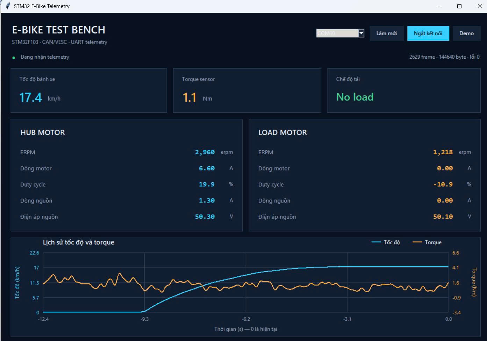
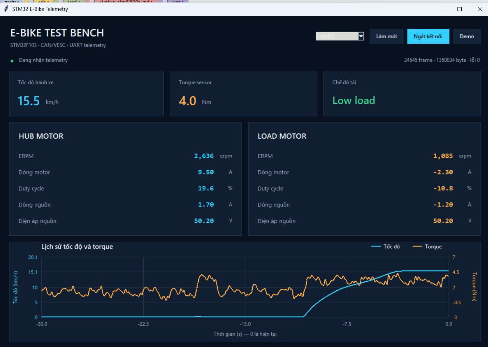
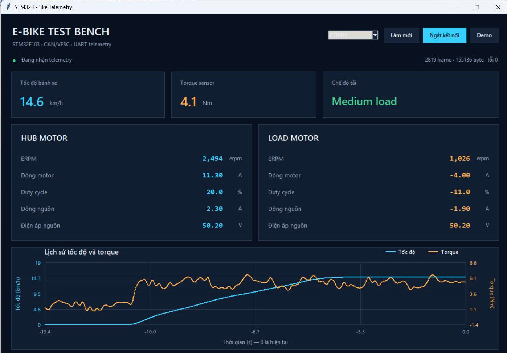
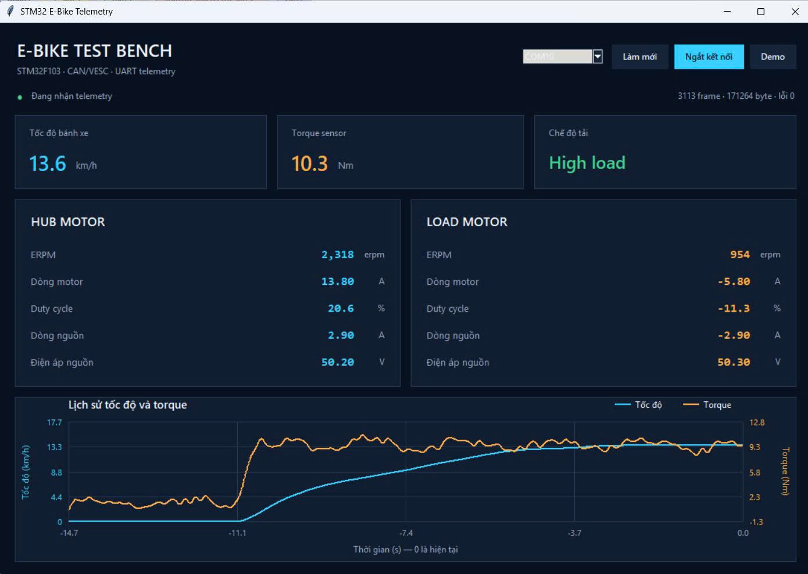

# In-wheel Motor Test Bench Rebuild

Dự án xây dựng lại hệ thống thu thập dữ liệu và giao tiếp CAN với VESC (Vedder Electronic Speed Controller) cho băng thử động cơ 

## Phạm vi dự án

Đồ án nghiên cứu hệ thống băng thử động cơ In-wheel Motor, bao gồm:

- Kết cấu cơ khí hai quả lô
- Hub motor BLDC (Bosch 48W - 1200W)
- Load motor PMSM (Motenergy ME0201013001)
- Hai bộ điều khiển VESC (Vedder Electronic Speed Controller)
- Cảm biến Mô-mem xoắn (Burster 8645-5500)
- Hệ thống thu thập dữ liệu và giám sát (Data Acquisition)

### Phạm vi Repository

Phạm vi này tập trung xây dựng lại phần hệ thống thu nhập dữ liệu (Data Acquisition)

- Lập trình STM32F103CBT6/STM32F103C8T6 ở mức thanh ghi
- Thu thập tín hiệu Torque Sensor bằng ADC-DMA
- Giao tiếp CAN với bộ điều khiển VESCs
- Giải mã các Frame Status từ VESCs
- Cấu hình và gửi lệnh đặt dòng phanh đến Load VESCs
- Truyền Telemetry binary đến máy tính qua giao thức UART.

## Mục tiêu

- Hiểu nguyên lý hoạt động của Hệ thống băng thử động cơ và xây dựng hệ thống thu thập dữ liệu DAQ - Data Acquisition
- Lập trình các ngoại vi GPIO, TIMER, USART, ADC, CAN kết hợp thêm DMA trên vi điều khiển trung tâm STM32F103CBT6 ở mức thanh ghi.
- Thu thập tín hiệu từ cảm biến Mô-men xoắn.
- Nhận và giải mã dữ liệu từ các VESCs thông qua CAN bus.
- Đóng gói dữ liệu từ cảm biến Mô-men xoắn và dữ liệu từ VESCs, truyền dữ liệu Telemetry tới máy tính qua UART.

## Phần cứng

### 1. Power and Control Board

Bo mạch trung tâm do nhóm thiết kế, bao gồm:

- STM32F103CBT6
- CAN transceiver MCP2551
- Mạch hạ áp 48-12V
- Mạch hạ áp 12-5V
- Đầu nối Torque Sensor Burster 8645-5500
- Đầu nối công tắc chọn mức tải
- Đầu nối ON/OFF và Emergency
- Các đầu nối Domino nguồn và tín hiệu

### 2. Hệ thống truyền động và tạo tải

- Hub motor with Hub VESC
- Load motor with Load VESC
- Battery 13S-5P
- Relay ngắt nguồn VESC 

### 3. Cảm biến và thiết bị đầu vào 

- Torque sensor Burster 8645-5500
- Throttle 
- Công tắc chọn nấc tải

### 4. Bộ điều khiển VESC 

- Load VESC điều khiển Load motor PMSM 
- Hub VESC điều khiển In-wheel Motor BLDC 

### 5. Công cụ lập trình và đo kiểm

- ST-link debugger
- USB to UART
- USB to CAN
- Logic Analyzer
- Oscilloscope

## Kiến trúc hệ thống 

```text
Throttle —————————————————————> Hub VESC ——————————————————> BLDC Motor
                                    |
                                  CANRx 
                                    |
                                    ▼
Torque Sensor --- ADC-DMA ---> STM32F103CBT6 --- UART-DMA ---> PC Dashboard
                                ▲   |    ▲
                                |   |    |  
                               GPIO |    |
Load level Switches ————————————|   |  CANRx
                                 CANTx   |
                                    |    |              
                                    ▼    |              
                                    Load VESC ———————> PMSM Motor
```

## Kết nối phần cứng

### STM32F103

|Pin STM32  |   Kết nối                 |   Chức năng                   |
|-----------|---------------------------|-------------------------------|
|   PA0     |   Torque Sensor           |   Đọc tín hiệu Analog (ADC1)  |
|   PA1     |   Công tắc tải nhẹ        |   Ngõ vào GPIO Pull up        |
|   PA2     |   Công tắc tải trung bình |   Ngõ vào GPIO Pull up        |
|   PA3     |   Công tắc tải nặng       |   Ngõ vào GPIO Pull up        |
|   PA9     |   USART Transmit          |   Truyền UART Telemetry       |      
|   PA11    |   CAN Transceiver RX      |   CAN RX                      |       
|   PA12    |   CAN Transceiver TX      |   CAN TX                      |       
|   5V      |   Mạch hạ áp 12-5V        |   Cấp nguồn                   |       
|   GND     |   Mạch hạ áp 12-5V        |   Mốc điện áp chung           |

### CAN bus

STM32F1 PA12 ---> TXD [CAN Transceiver] CANH <---> CANH [VESCs]
STM32F1 PA11 <--- RXD [CAN Transceiver] CANL <---> CANL [VESCs]

## Cấu hình VESC

Hai VESC sử dụng firmware đã được cài sẵn. Dự án chỉ cấu hình thông số bằng VESC Tool và không sửa đổi thuật toán điều khiển bên trong VESC

### Setup FOC for BLDC motor (In-wheel Motor)

Trong giao diện màn hình chính VESC Tool, chủ yếu chọn số cặp cực cho Motor

- Bước 1: Chọn Setup Motors 
- Bước 2: Chọn động cơ xoay chiều không chổi than
- Bước 3: Chọn số cực cho BLDC motor là 30 cực (15 cặp cực)
- Bước 4: Chọn Start Detection

Thông thường VESC Tool sẽ báo lỗi " NO HALL" đối với BLDC Motor, ta tiến hành setup thủ công ở mục Motor Settings--> FOC--->General--->Sensor mode: Hall-Sensors--->Detect and Calculate Parameters.
Sau đó vào mục Hall Sensors ---> Start Detection ---> Apply

### Setup FOC for PMSM motor (Load Motor)

Trong giao diện màn hình chính VESC Tool, chủ yếu chọn số cặp cực cho Motor

- Bước 1: Chọn Setup Motors 
- Bước 2: Chọn động cơ xoay chiều không chổi than
- Bước 3: Chọn số cực cho PMSM motor là 8 cực (4 cặp cực)
- Bước 4: Chọn Start Detection

## Firmware STM32F1

### Chức năng chính

- Cấu hình các ngoại vi ở mức thanh ghi
- Thu thập và giải mã các CAN frame từ VESC nodes
- Thu thập tín hiệu Analog từ Torque Sensor bằng ADC kết hợp DMA
- Đọc công tắc chọn mức tải bằng GPIO
- Gửi lệnh hãm phanh đến Load VESC qua giao thức CAN
- Đóng gói và truyền dữ liệu bằng UART kết hợp DMA theo dạng Telemetry

### Luồng hoạt động

- Khởi tạo clock sử dụng thạch anh ngoài 8MHz và các ngoại vi
- Đọc tín hiệu analog, lấy trung bình lọc và quy đổi tín hiệu Torque
- Nhận frame CAN bằng ngắt FIFO, đọc frame từ Mailbox, giải mã dữ liệu từ VESC và lưu vào RAM
- Đọc mức tải thông qua GPIO, sau đó gửi lệnh hãm phanh đến Load VESC
- Đóng gói dữ liệu đã lưu trong RAM và truyền 55 byte bằng USART1 kết hợp DMA đến máy tính

## Giao thức truyền thông

### CAN bus

Note: Các giá trị Packet ID trong phần này được định nghĩa bởi giao thức CAN của VESC  
Dự án chỉ triển khai việc tạo, truyền và giải mã các frame tương thích với giao thức này

Source:
- [VESC CAN Communication Documentation](https://github.com/vedderb/bldc/blob/master/documentation/comm_can.md)
- [VESC Firmware Repository](https://github.com/vedderb/bldc)

#### CAN bus Receive

MCU giao tiếp với VESCs thông qua CAN bus, mục đích là giám sát và nhận frame trạng thái 

- Tốc độ Baudrate: 500kbps
- Cấu trúc nhận frame: Extended ID 29 bit(gồm ID command Status + ID node)
- Kiểu frame: Data frame
- Độ dài frame: 8 byte
- ID node Hub: 0x65 (101)
- ID node Load: 0x43 (67)

Command Status frame

|   Frame       |   Command ID  |   Data                                                              |  
|---------------|---------------|---------------------------------------------------------------------|
|   Status 1    |       9       |   ERPM, Motor current, duty cycle                                   |
|   Status 2    |       14      |   Ah used, Ah charged                                               |
|   Status 3    |       15      |   Wh used, Wh charged                                               |
|   Status 4    |       16      |   MOSFET temperature, motor temperature, input current, PID position|
|   Status 5    |       27      |   Tachometer, input voltage                                         |


#### CAN bus Transmit

MCU giao tiếp với Load VESC để truyền lệnh tải dựa trên công tắc chọn mức tải 

- Tốc độ Baudrate: 500kbps
- Cấu trúc truyền frame: Extended ID 29 bit(gồm Command ID + ID node)
- Kiểu frame: Data frame
- Độ dài frame: 4 byte
- ID node Load: 0x43 (67)

Command brake frame

|   Command Name                 |   Command ID  |
|--------------------------------|---------------|
|   CAN_PACKET_SET_CURRENT_BRAKE |       2       |


### Giao thức UART Telemetry

Sử dụng giao thức nhị phân do dự án tự định nghĩa để truyền dữ liệu từ STM32F1 đến ứng dụng Python hoặc MATLAB/Simulink

#### Cấu hình UART

|   Thông số            |   Gía trị       |
|-----------------------|-----------------|
|  USART                | USART1          |
|  TX                   | PA9             |
|  Baudrate             | 115200          |
|  Databits             | 8 bit           |
|  Phương thức truyền   | DMA1 Channel 4  |

Luồng hoạt động:

STM32F1 PA9(TX) ---> USB TO UART ---> PC dashboard

#### Cấu trúc frame 

|   HEADER  |   Payload     | End byte  |
|-----------|---------------|-----------|
|'0x67 0x89'|   Byte 2-53   |   '0xFF'  |

##### Thứ tự dữ liệu trong Payload

Vì Status có rất nhiều trường, trong dự án này chỉ lấy 13 trường quan trọng bao gồm:


| index | Offset    | Trường dữ liệu        | Giá trị truyền            |
|-------|-----------|-----------------------|---------------------------|
| 0     | 2–5       | Load level            | Mã `0–3` dạng `float32`   |
| 1     | 6–9       | Torque                | Giá trị thực              |
| 2     | 10–13     | Hub ERPM              | Giá trị ERPM              |
| 3     | 14–17     | Hub speed             | Giá trị thực              |
| 4     | 18–21     | Hub motor current     | Giá trị thô               |
| 5     | 22–25     | Hub duty cycle        | Giá trị thô               |
| 6     | 26–29     | Hub input current     | Giá trị thô               |
| 7     | 30–33     | Hub input voltage     | Giá trị thô               | 
| 8     | 34–37     | Load ERPM             | Giá trị ERPM              |
| 9     | 38–41     | Load motor current    | Giá trị thô               | 
| 10    | 42–45     | Load duty cycle       | Giá trị thô               | 
| 11    | 46–49     | Load input current    | Giá trị thô               | 
| 12    | 50–53     | Load input voltage    | Giá trị thô               | 


#### Quy trình truyền

1. Firmware cập nhật 13 trường trong `buffer_data`
2. sử dụng `memcpy()` sao chép 52 byte payload vào `tx_buffer`
3. Firmware thêm 2 byte header và 1 end byte để phía nhận đồng bộ frame 
4. DMA truyền toàn bộ 55 byte từ tx_buffer (RAM) vào thanh ghi `USART1_DR`
5. Ứng dụng PC tìm byte Header, chờ đủ 55 byte và kiểm tra byte End
6. Payload được giải mã thành 13 giá trị theo kiểu dữ liệu float

Ví dụ giải mã payload bằng Python:

```python
values = struct.unpack("<13f", frame[2:54])
```

## Cấu trúc thư mục

```text
In-Wheel-Motor-Testbench-Rebuild/
├── Driver/
│   ├── adc.c / adc.h       # ADC1 đọc torque sensor
│   ├── afio.c / afio.h     # Cấu hình alternate function
│   ├── can.c / can.h       # bxCAN, frame STATUS và lệnh phanh
│   ├── dma.c / dma.h       # DMA cho ADC và USART1
│   ├── gpio.c / gpio.h     # GPIO và công tắc mức tải
│   ├── rcc.c / rcc.h       # Clock hệ thống và ngoại vi
│   ├── tim.c / tim.h       # Timer
│   ├── uart.c / uart.h     # USART1 telemetry
│   ├── exti.c / exti.h     # External interrupt
│   └── TYPE.h              # Định nghĩa thanh ghi và kiểu dữ liệu
│
├── Register/
│   └── Dev/
│       ├── Src/
│       │   └── main.c      # Luồng chính và đóng gói telemetry
│       ├── RTE/            # Startup và system files cho STM32F103
│       ├── DebugConfig/    # Cấu hình debug của Keil
│       └── stm32f1_register.uvprojx
│                           # Project Keil MDK
│
├── MISSION.md              # Mục tiêu và phạm vi dự án
├── NOTES.md                # Ghi chú trong quá trình phát triển
├── RESOURCES.md            # Tài liệu tham khảo
└── README.md               # Tài liệu tổng quan của repository
```

## Build firmware STM32F103

### Yêu cầu

- KeilC MDK-ARM
-STM32F1

### Các bước build 
1. Mở project Keil: 
   ```text
   Register/Dev/stm32f1_register.uvprojx
   ```

2. Chọn target 'Project'
3. Nhấn Build(F7), sau đó nhấn F8 để nạp firmware 
4. Kiểm tra kết quả build trong cửa sổ Build Output

File chương trình sau khi build:

```text
Register/Dev/Objects/stm32f1_register.axf
```
> Firmware có thể được build mà không cần phần cứng. Các chức năng CAN và torque sensor hiện được kiểm thử bằng STM32F407 mô phỏng; việc xác nhận toàn bộ hệ thống yêu cầu băng thử và các VESC thực tế.

## Kết quả thử nghiệm

Các chức năng đã được kiểm tra:

- STM32F103 nhận và giải mã frame STATUS của hai node VESC.
- Lệnh `CAN_PACKET_SET_CURRENT_BRAKE` được gửi tới Load VESC với Extended ID `0x243`.
- Mức tải được lựa chọn bằng các ngõ vào GPIO PA1–PA3.
- ADC1 và DMA thu thập tín hiệu mô phỏng torque sensor.
- USART1 và DMA truyền liên tục frame telemetry 55 byte.
- Ứng dụng Python đồng bộ, giải mã và hiển thị dữ liệu theo thời gian thực.

> Trong quá trình rebuild, STM32F407 được sử dụng để mô phỏng tín hiệu torque sensor và các frame CAN của hai VESC. Các kết quả này không đại diện cho phép đo đầy đủ trên băng thử cơ khí thực tế.               

### Kết quả
Các kết quả dưới đây được thu thập ở mức tay ga cố định 20% với STM32F4 mô phỏng hai VESC và cảm biến torque.

| Không tải                                                 | Tải nhẹ                                                 |
|-----------------------------------------------------------|---------------------------------------------------------|
|   |  |

| Tải trung bình                                            | Tải nặng                                                          |
|-----------------------------------------------------------|-------------------------------------------------------------------|
|  |  |


*Giao diện hiển thị dữ liệu telemetry nhận từ STM32F103.*

